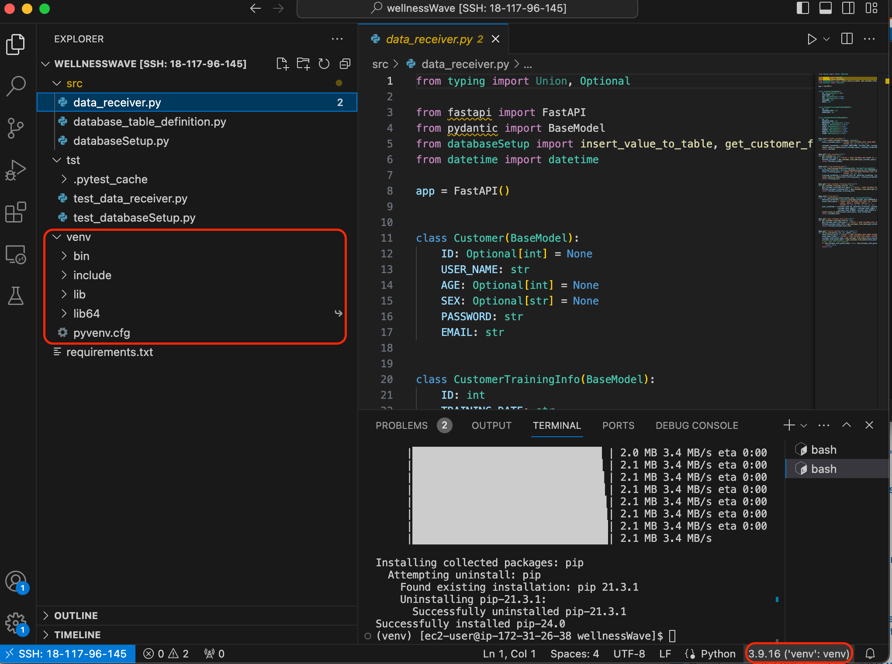

# Installation steps

- in the new machine create a folder /wellnessWave
- copy /src, /tst and requirement.txt from deprecated machine to the new machine under /wellnessWave
- through vscode, go to /wellnessWave, run `python3 -m venv venv`
- check if folder /venv being created (image below)
- on the bottom right corner, click the button next to "python 3.9.16"
- you will see a drop down on the top, select a recommended environment.
- go to vscode terminal, press + opening a new vscode terminal. 
- last step will auto run `source /home/ec2-user/wellnessWave/venv/bin/activate`. only need to check if "(venv)" shown in terminal.

